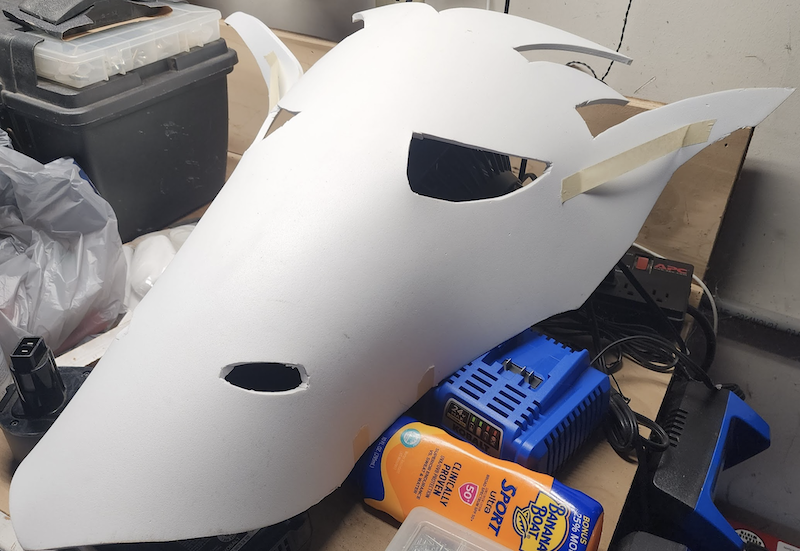

# Halloween Vending Machine

## Mark II

A brief outline:

Painting the front panels 

Marking and placing the dowel rod mounts 

Gluing & screwing on the dowel rod mounts 

Adding hinges to the front panels to make them a larger, foldable structure 

 

Test assembly of the panels, dowel rods, and overhead sign 

1. Paint details & designs on the front panels & signs 

1. Paint buttons and text for buttons 

1. Template, cut, curve, and heat mold the dragon head out of EVA foam 

1. Prime and paint the dragon's head 

1. Code an Adafruit Express as an LED backlight for the dragon's head 

1. Solder jumper wires to the LED strips for the candy ramp 

1. Connect buttons, a battery pack, and LED strips to an Arduino. Code to make a fade effect for lighting. 

1. Pull the LED strips through the candy ramp, adhere to the sides. Attach Arduino and battery pack underneath the ramp 

1. Drill holes & mount the button guides within the front panels 

1. Anchor entire assembly to front porch 

1. Anchor dragon head, candy ramp, insert buttons, add lighting accents 

